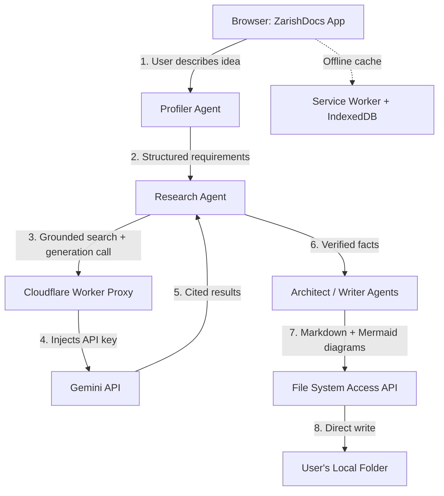

# 003-tech-design-zarishdocs.md
## Technical Design Document: ZarishDocs MVP
### Architecture, component design, and resolved build decisions

**Document type:** Specification
**Date:** August 11, 2026
**Author:** Mohammad Ariful Islam / ZarishSphere Foundation
**License:** Apache 2.0 (code) · CC BY 4.0 (documentation)
**Status:** V2 — Complete, build-ready. Resolves all carried-forward decisions from PRD-ZarishDocs-MVP.md and V1.

---

## 1. System Architecture Overview

ZarishDocs is a single-page, client-heavy web app with exactly one small piece of edge compute. Everything else — UI, agent orchestration, local file writes, semantic search — runs in the user's browser.



Only step 4 leaves a server-side footprint, and it is a stateless edge function, not a maintained backend.

## 2. ADR-001: LLM & Search Backend Architecture

### Decision
Ship a **hybrid, flexible architecture**: a free Cloudflare Worker proxy is the default path for every user, with an optional "bring your own key" mode for advanced users who want to bypass the shared proxy's rate ceiling or keep their calls fully isolated.

### Context
The research identified two viable options and asked for the "best, most flexible" resolution rather than a single rigid pick:
- **Proxy-only:** simplest for the user, but every user shares the proxy's underlying quota unless keyed separately
- **Own-key-only:** removes shared-quota risk, but pushes API key setup back onto a non-technical user — directly against the "no coding experience" target persona

### Decision detail
1. **Default path — Cloudflare Worker proxy.** A single stateless Worker function holds the `GEMINI_API_KEY` as an encrypted environment secret (`wrangler secret put GEMINI_API_KEY`), accepts a request from the browser, forwards it to the Gemini API, and returns the response with permissive CORS headers scoped to the ZarishDocs origin only. No user setup required — this is the zero-friction path the target persona (Maya) needs.
2. **Advanced path — user-supplied key.** A settings panel, clearly labeled "Advanced," lets a user paste their own free Gemini API key. When present, calls bypass the Worker and go straight from the browser to Gemini. The key is held only in browser `sessionStorage` (cleared on tab close, never written to disk, never sent anywhere but Google's endpoint) and the UI states plainly that the key is visible in that browser's network tab — an accepted, disclosed trade-off for a single-user local tool, consistent with the research's risk framing.
3. Both paths call the **same agent logic** — the app only swaps which endpoint it calls and whether it injects a stored key. This keeps the codebase single-path past the network layer. The endpoint-swap abstraction ships in the MVP; the own-key **UI panel** is deferred to post-MVP (§16.2).

### Search mechanism (resolves a gap the original research left open)
The Research Agent does not need a separate search API. **Gemini's built-in "Grounding with Google Search" tool** is free on the **Gemini 2.5 family** — up to **500 grounded requests/day shared across 2.5 Flash and Flash-Lite** on the free tier, tracked separately from plain generation quota. **Correction (verified 2026-08-11):** grounding on the **Gemini 3.x family is paid-only** (5,000 prompts/month free then billed, priced per search query executed rather than per prompt) — do not route grounded calls to 3.x. Enabling it is a single tool flag (`"tools": [{"google_search": {}}]`) on the same API call already being proxied — no second vendor, no second free-tier to track. The model returns inline citations and source URLs directly (`groundingMetadata`), which is exactly what the citation-first requirement needs.

**Caveat to build in, not just note:** grounding quota and plain generation quota are tracked separately by Google, but at least one third-party report found a client misconfiguration miscounting grounded calls against the wrong (much smaller) quota bucket. The Worker proxy must explicitly set the tool-use path correctly and report which quota a response consumed (see §16.3), so this failure mode is caught in testing rather than surfacing as a mysterious 429 for the user.

### Model routing (carried from research, reconfirmed)
| Task | Model | Why |
|---|---|---|
| Profiler Agent (casual text → structured requirements) | Gemini Flash-Lite | Highest daily ceiling, adequate for structured extraction |
| Research Agent (grounded search + fact verification) | Gemini 2.5 Flash | Free Google-Search grounding lives on the 2.5 family (500 RPD shared Flash + Flash-Lite); 3.x grounding is paid-only (corrected 2026-08-11) |
| Architect/Writer Agents (final document synthesis) | Gemini Flash | Best quality-to-quota ratio; Pro is no longer free-tier as of April 2026 |

### Consequences
- Zero cost preserved either way; zero ongoing server maintenance either way
- Shared-proxy users are subject to whatever aggregate rate limit the single Cloud project has — acceptable for personal/small-scale use, and the advanced path exists precisely for anyone who outgrows it
- The app must handle two auth code paths, adding minor complexity, in exchange for genuinely serving both the target persona and any power user

### Status
Accepted

---

## 3. ADR-002: Domain-Aware Research Sourcing

### Decision
Implement domain-aware sourcing as a **client-side routing config**, not as separate API integrations per domain. A lookup table maps topic keywords to a preferred-source domain list; that list is injected into the grounding prompt as an explicit instruction, and returned grounding citations are re-ranked (not filtered out) by whether they match the preferred domains for that topic.

### Context
The PRD requires that GitHub-related output research GitHub's own docs, Cloudflare-related output research Cloudflare's own docs, and so on, rather than generic aggregator sites. Google Search grounding does not expose a hard `site:` restriction parameter through the Gemini API — so this can't be enforced as a query filter. It has to be handled as prompt instruction plus post-response ranking.

### Decision detail

**Source-mapping config (`sources.config.json`, shipped with the app, user-editable later) — committed at repo root:**

```json
{
  "version": 1,
  "domains": {
    "github": ["docs.github.com", "github.blog", "github.com"],
    "cloudflare": ["developers.cloudflare.com", "blog.cloudflare.com"],
    "google-cloud": ["cloud.google.com", "developers.google.com"],
    "google-workspace": ["developers.google.com", "workspace.google.com"],
    "fhir": ["hl7.org", "build.fhir.org"],
    "npm-package": ["npmjs.com", "github.com"],
    "browser-api": ["developer.mozilla.org", "developer.chrome.com", "caniuse.com"],
    "w3c-standard": ["w3.org", "webmachinelearning.github.io"],
    "default": []
  }
}
```

**Pipeline:**
1. The Profiler Agent tags each structured requirement with a topic category from the config (falls back to `"default"` — general web grounding, no domain bias — if nothing matches).
2. The Research Agent's grounded prompt includes the explicit domain-bias instruction (§9.2): *"When researching \[topic\], prioritize official sources: \[preferred domain list\]. Only use other sources if the official docs don't cover this."*
3. When grounding results return, citations are re-ranked so preferred-domain sources appear first in the generated document's citation list; off-domain sources are kept, not discarded, since grounding can legitimately need third-party context — but they're visibly secondary.
4. The version-verification requirement ("check current stable version as of today, even for old resources") is handled by the same grounded call: the prompt template always asks for the specific version number and release date, not just "is this the right tool."

### Consequences
- No extra vendor integration, no extra free-tier to track — this rides entirely on the same grounded Gemini call from ADR-001
- Source-domain enforcement is a strong preference, not a hard guarantee, since the underlying Search grounding tool doesn't support hard filtering — this should be disclosed in the generated document's methodology note ("sources prioritized by domain, not exclusively restricted")
- The config is a plain JSON file, so extending it to new domains is a one-line addition, not a code change

### Status
Accepted

---

## 4. ADR-003: Local File Access & Cross-Browser Fallback

### Decision
Use the `browser-fs-access` library (verified v0.38.x) rather than a hand-rolled feature check. It uses the native File System Access API where available (Chrome/Edge/Opera desktop) and transparently falls back to `<input type="file">` / `<a download>` elsewhere — one code path, not a maintained if/else fork.

### Context
This was carried forward from the research as an open UX question, not just a library choice: File System Access API support is Chromium-desktop-only. Safari, Firefox, and every mobile browser need a real fallback, not a dead end.

### Decision detail
- On supported browsers: one-time folder picker (`showDirectoryPicker`), all subsequent writes go straight to that folder with no repeated prompts. Use the library's exported `supported` flag to detect the path at first load.
- On unsupported browsers: the same "Choose your folder" button instead triggers a labeled "Your browser can't write directly to a folder — files will download instead" flow. Every generated file downloads individually with the same filenames it would have used on disk (`PRD-[AppName]-MVP.md`, etc.), so the user still ends up with an organized set they can drop into any folder manually.
- This distinction is surfaced **in the UI on first load**, not discovered mid-generation — consistent with the PRD's quality standard against silent failures.
- Library quirks to code around: legacy (non-FS-Access) save cannot throw exceptions — use `legacySetup`; `directoryOpen()` returns the directory handle for empty dirs.

### Consequences
- Full feature parity in outcome (user gets the same files either way); parity in convenience is not possible and shouldn't be promised
- No dependency on browser vendors changing course — Safari's non-support has been stable for years and shouldn't be treated as a near-term fix

### Status
Accepted

---

## 5. Component Breakdown

| Component | Responsibility | Runs where |
|---|---|---|
| Profiler Agent | Casual text → structured requirements + topic tags | Browser (calls proxy/direct API) |
| Research Agent | Grounded, domain-biased search and fact verification | Browser (calls proxy/direct API) |
| Architect Agent | Structures verified facts into document outlines | Browser (calls proxy/direct API) |
| Writer Agent | Renders outlines into final Markdown + Mermaid | Browser (calls proxy/direct API) |
| Cloudflare Worker Proxy | Injects API key, forwards request, returns response | Cloudflare edge (default path only) |
| File Writer | Local folder write via `browser-fs-access` | Browser |
| Offline Shell | Service Worker cache of app assets; IndexedDB for session/project state | Browser |
| Embedding Worker | Lazy `all-MiniLM-L6-v2` embeddings in a module Web Worker | Browser |

## 6. Tech Stack Summary

| Layer | Choice | Version (verified August 2026) |
|---|---|---|
| LLM | Gemini 2.5 Flash-Lite (Profiler/Writer) / 2.5 Flash (Research grounding) | Free grounding is 2.5-family only — 3.x grounding is paid-only |
| Local file access | `browser-fs-access` | 0.38.x (June 2025 release) |
| Diagram rendering | Mermaid.js (CDN) | 11.16.1 — pin this exact version; it backports security fixes |
| Semantic search (client-side, lazy-loaded) | transformers.js + `all-MiniLM-L6-v2` (q8) | transformers.js 4.x (verified 4.2.0); ~23MB model, `dtype: 'q8'`, auto-cached by the library |
| Offline shell | Service Worker + IndexedDB | Native browser APIs, no library pin |
| Hosting | Cloudflare Pages (static) + Cloudflare Workers (proxy) | Free tier, no card required |
| Lint/format/test (Phase 1 decision, §12) | Prettier + Node's built-in `node:test` | Zero build step, zero framework |

## 7. Folder Structure

### 7.1 Repo (this project)
```
zarishdocs/
├── AGENTS.md                  # Master plan (source of truth for agents)
├── MEMORY.md                  # Session memory
├── REVIEW-CHECKLIST.md        # Definition of done
├── agent_docs/                # Progressive-disclosure detail docs
├── docs/                      # This document set (research/PRD/TechDesign)
├── sources.config.json        # ADR-002 domain mapping (committed)
├── worker/                    # Cloudflare Worker proxy (ADR-001)
│   ├── index.js
│   └── wrangler.toml
├── src/                       # App code (built in Phase 1–2)
│   ├── index.html
│   ├── styles.css
│   ├── app.js                 # Orchestration entrypoint
│   ├── api.js                 # LLM client (proxy/direct swap)
│   ├── agents/                # profiler.js, research.js, architect.js, writer.js
│   ├── file-writer.js         # browser-fs-access wrapper
│   ├── db.js                  # IndexedDB
│   ├── sw.js                  # Service Worker
│   ├── embed-worker.js        # transformers.js worker
│   └── manifest.webmanifest
└── specs/                     # Feature handoff artifacts (created during build)
```

### 7.2 Local output (user's chosen folder, ZUSS-aligned)
```
[user-chosen-folder]/
├── 001-research-[appname].md
├── 002-prd-[appname]-mvp.md
├── 003-tech-design-[appname].md
├── 004-adr-[appname]-[topic].md      (as generated, one per major decision)
└── diagrams/
    └── [nnn]-[diagram-name].mmd
```

## 8. Non-Functional Requirements Mapping

| PRD requirement | How this design satisfies it |
|---|---|
| Zero cost | Cloudflare Pages/Workers free tier + Gemini free tier + free 2.5-family grounding — no paid dependency anywhere |
| Privacy-first, no telemetry | Only outbound call is the proxied/direct Gemini call; no analytics service integrated |
| Offline-capable | Service Worker serves the app shell offline; live research and new generations correctly require connectivity and fail with a clear message, not a silent hang |
| Zero lock-in | Output is plain Markdown + Mermaid text, portable by design; Worker proxy code is a single portable file, not a proprietary platform feature |
| Extensibility | `sources.config.json` and model-routing table are both plain config, not hardcoded — future domains or models are additive |
| Accessibility | WCAG 2.1 AA; keyboard-operable controls; focus states; no color-only cues |
| Performance | Sub-100KB app shell; Mermaid (3.4MB) and the 23MB embedding model lazy-load after first use |

---

## 9. Prompt Templates (resolves carried-forward: exact prompt wording)

All templates are plain data in `src/agents/prompts.js`. Version them in the source so tests can assert the grounding instructions are present.

### 9.1 Profiler (Flash-Lite, no grounding)
```
You translate a plain-language app idea into a structured research brief for a
non-technical founder. The founder will never see this output.

From the user's idea text, extract:
1. a one-line product description,
2. up to 8 key capabilities/facts the research must verify,
3. the topic category for each capability, chosen from: github, cloudflare,
   google-cloud, google-workspace, fhir, npm-package, browser-api,
   w3c-standard, default.
Return strict JSON: {"summary": string, "requirements": [{capability, topic}]}.
Use ONLY the topics listed; unknown topics map to "default".
```

### 9.2 Research — domain-bias instruction (ADR-002)
```
When researching "{topic}", prioritize official sources: {preferredDomains}.
Only use other sources if the official docs don't cover this.
For every tool/library/service you recommend, report its current stable
version and release date AS OF TODAY. Do not rely on memory — use the search
tool. Return each verified fact with its source URL and the access date.
```
`{preferredDomains}` comes from `sources.config.json`; empty (`default`) yields *"Use authoritative sources."*

### 9.3 Architect (Flash, no grounding)
```
You receive verified, cited research facts. Structure them into the outline of
a linked document set: PRD, ADR, and Tech Design. Preserve every fact's source
URL and access date — never drop a citation. Flag any claim the research does
not support; do not invent facts.
```

### 9.4 Writer (Flash, no grounding)
```
Render the outline into three Markdown documents (PRD, ADR, Tech Design) that
cross-reference each other. Rules:
- Every technical claim keeps its citation: [source](url) (accessed YYYY-MM-DD).
- Use Mermaid for architecture/data-flow diagrams; output each diagram both
  inline and as a standalone .mmd file.
- Add a methodology note: "Sources were prioritized by domain, not exclusively
  restricted." to each document.
- Plain language, no unexplained jargon.
```

---

## 10. Data Model & Local Storage

### 10.1 IndexedDB — database `zarishdocs`, version 1
| Store | Key | Records | Notes |
|---|---|---|---|
| `sessions` | `id` (string, timestamp-based) | One per generation run | `{id, createdAt, ideaText, status, mode}` — `mode` = `proxy` or `ownKey` |
| `projects` | `id` (app name slug) | One per completed doc set | `{id, createdAt, docSet: {research, prd, techDesign, adrs}, sources: [{claim, url, accessDate, domain, rank}]}` |
| `settings` | fixed keys | ~3 rows | `{key: 'folderHandle', value: FileSystemDirectoryHandle}` (structured-clonable), `{key: 'theme'}`, `{key: 'sessionCount'}` |
| `embeddings` | `[projectId, textHash]` | Lazily populated | `{projectId, text, vector}` — written by the embed worker |

- **API key never touches IndexedDB** — it lives in `sessionStorage` only (ADR-001).
- Version the DB via `onupgradeneeded`; handle `onblocked` (another tab open); call `navigator.storage.persist()` to reduce eviction risk.
- Raw IndexedDB with a small promise wrapper — no `idb`/Dexie dependency.

### 10.2 Service Worker caches (from `agent_docs/code_patterns.md`)
| Cache | Contents | Strategy |
|---|---|---|
| `shell-v1` | `index.html`, CSS, app JS, workers, manifest | Precached, cache-first, immutable |
| `runtime-cdn-v1` | Mermaid CDN (pinned 11.16.1) | Stale-while-revalidate; NOT precached (3.4MB) |
| `transformers-cache` | Embedding model files | Managed by transformers.js — never touch |

Navigation: network-first falling back to shell; `skipWaiting()` only after `addAll` completes. **Cloudflare Pages gotcha:** never include `_headers`/`_redirects` in `addAll()` — they aren't served as static assets and will break SW registration.

### 10.3 PWA manifest
`name`/`short_name`, `start_url: "/"`, `display: "standalone"`, 192px + 512px maskable icons, theme color. Chromium installability also needs the registered Service Worker with a fetch handler (Android still requires it; desktop Chrome relaxed this in v112).

---

## 11. Feature-by-Feature Implementation (PRD P0)

Each feature is one service module + one UI wiring step, built and verified in order.

### F1 — One-Click Local Folder Access (ADR-003)
- `src/file-writer.js`: wraps `browser-fs-access`. `supported` flag → first-load banner. `writeSet(projectName, files)` writes `002-prd-…-mvp.md` etc. directly on Chromium, or downloads each file with identical filenames elsewhere.
- **Accept:** folder picker works in Chrome/Edge/Opera desktop with direct writes; Safari/Firefox/mobile get a clear working download fallback; banner shows on first load, not mid-generation.

### F2 — The Vibe Translator (Profiler)
- `src/agents/profiler.js`: validate idea text (non-empty, sane length) → call `api.js` (Flash-Lite, no grounding, template §9.1) → validate the returned JSON shape → emit `requirements[]` + topic tags.
- **Accept:** free-form conversational input with no required format; structured output the Research Agent can act on; no jargon shown to the user.

### F3 — The Live Web Scanner (Research)
- `src/agents/research.js`: for each requirement, build a grounded call (2.5 Flash, `tools: [{google_search: {}}]`, template §9.2) → read `groundingMetadata` citations → re-rank preferred-domain sources first → verify versions/access dates → emit verified facts.
- `src/api.js` maps 429 → "free-tier rate limit — wait a moment" via the worker's consistent error shape.
- **Accept:** every technical claim tied to a live source with an access date; official domains ranked first in citations.

### F4 — The Auto-Writer (Architect & Writer)
- `src/agents/architect.js`: verified facts → outline (template §9.3). `src/agents/writer.js`: outline → linked PRD + ADR + Tech Design Markdown with Mermaid (template §9.4), inline + `.mmd` files.
- **Accept:** at least PRD + ADR + Tech Design as separate, cross-referenced files; Mermaid renders without manual fixing; methodology note present.

### Error handling (cross-cutting)
- `src/errors.js`: one error shape `{kind, message, retryable}`; UI maps kinds to friendly copy (offline → "reconnect to continue", 429 → "wait a bit", unsupported browser → fallback banner). No raw exceptions reach the UI.

---

## 12. Project Setup Checklist (Phase 1)

1. Create `src/` shell: `index.html`, `styles.css`, `app.js`, `sw.js`, `db.js`, `manifest.webmanifest`, `api.js`, `errors.js`.
2. Settle tooling (decision): **Prettier** for formatting + **Node built-in `node:test`** for unit tests — zero build step, zero framework, no new runtime deps. Commands: `npm test` runs `node --test src/`. (Alternative considered: Vitest + ESLint — heavier, watch mode; not needed for MVP.)
3. `sources.config.json` (done — committed at root).
4. Worker proxy (done — `worker/` scaffolded). Deploy per §13.
5. Verify: static serve works (`python3 -m http.server 8080`); SW registers; IndexedDB opens; `node --test` passes.

---

## 13. Deployment Plan

1. In `worker/wrangler.toml`, set `ALLOWED_ORIGIN` to the real Pages origin (e.g. `https://your-site.pages.dev`).
2. From `worker/`: `wrangler secret put GEMINI_API_KEY` → `wrangler deploy`.
3. Build the app (Phase 2), then from repo root: `wrangler pages deploy src`.
4. Smoke test: browser → idea in → docs out; check the proxy returns `x-zarish-quota-bucket` on responses (grounding vs generation).
5. Verify quota accounting: two clocks matter — Cloudflare resets midnight UTC (100k req/day, shared with Pages Functions), Gemini resets midnight Pacific.

---

## 14. Cost Breakdown (verified August 2026)

| Item | Cost | Notes |
|---|---|---|
| Cloudflare Pages | $0 | Unlimited static requests/bandwidth; 500 builds/mo |
| Cloudflare Workers | $0 | 100k requests/day (shared with Pages Functions); 50 subrequests/request |
| Gemini free tier | $0 | Grounding on 2.5 family: 500 RPD shared Flash + Flash-Lite |
| transformers.js, Mermaid, browser-fs-access | $0 | OSS / CDN |
| **Total** | **$0/month** | One full doc-set session ≈ 10–30 LLM calls — inside daily free limits |

**Caveats to disclose to the user (not hide):** Gemini free tier may use prompts/responses to improve Google products; grounding counts per search query, not per prompt. Both are disclosed in the generated docs' methodology note and the UI's privacy line.

---

## 15. Build Success Checklist (Definition of Done)

From PRD-ZarishDocs-MVP.md + REVIEW-CHECKLIST.md. The MVP is "working" when:
- [ ] All four P0 features functional (F1–F4 acceptance criteria above)
- [ ] Basic error handling: failed research call, unsupported browser, free-tier 429 — all fail gracefully with a clear message
- [ ] Folder-write path works on Chromium desktop; download fallback works everywhere else (browser-verified)
- [ ] One complete journey end-to-end: idea in → cited research → PRD+ADR+TechDesign out
- [ ] Offline shell loads from the Service Worker; live research shows a clear "reconnect" state
- [ ] Worker proxy validates Origin, scopes CORS, rejects unknown models, logs quota bucket
- [ ] Local-only session confirmation (IndexedDB counter, never transmitted)
- [ ] Deployment to Cloudflare Pages + Worker proxy complete; self-test with a real idea done

---

## 16. Final Resolutions (carried-forward questions from V1)

1. **Exact grounding prompt wording** → fixed in §9.2 (ADR-002 domain-bias) and §9.3/§9.4 (citation discipline). Pinned in `src/agents/prompts.js`.
2. **Own-key panel in MVP?** → **No — post-MVP.** The endpoint-swap abstraction (`api.js` with `mode` = `proxy` | `ownKey`) ships now; the "Advanced" settings UI ships after the 3-day MVP, because the proxy path alone satisfies all four P0 features.
3. **Grounding-vs-generation quota separation** → the Worker sets the tool-use path correctly and emits `x-zarish-quota-bucket` on every response; verified by an integration test in Phase 1 (call both paths, assert the header and correct 429 behavior). See §13.4–13.5 and `MEMORY.md`.

**Supersedes:** any V1 statement implying Gemini 3.x free grounding (corrected in §2, §6) and the V1 "5,000/month" grounding allowance (free is 500 RPD on the 2.5 family). The Handoff Context block below remains as the historical V1 record.

---

*ZarishSphere Foundation · V2 · August 2026*
*License: Apache 2.0 (code) · CC BY 4.0 (documentation)*
*GitHub: https://github.com/zarishsphere*

---
## Handoff Context
<!-- Machine-readable summary for the next workflow step. Do not delete; the next prompt in the workflow reads this block. -->
- Stage: tech-design
- App name: ZarishDocs
- User level: A (vibe coder)
- Target platform: web
- Budget: $0 (Cloudflare Worker proxy + Gemini free tier + free Google Search grounding, 5,000/month)
- Timeline: 3 days for MVP tier
- Source files: research-ZarishDocs.md → PRD-ZarishDocs-MVP.md → 003-tech-design-zarishdocs.md
- Resolved decisions: (1) Hybrid Cloudflare Worker proxy [default] + optional user-supplied key [advanced], (2) domain-aware sourcing via client-side config + prompt bias + citation re-ranking, (3) browser-fs-access library for local file writes with visible download fallback
- Carried forward: exact grounding prompt wording, whether "own key" panel ships in MVP or post-MVP, verifying grounding-vs-generation quota separation in practice
---
