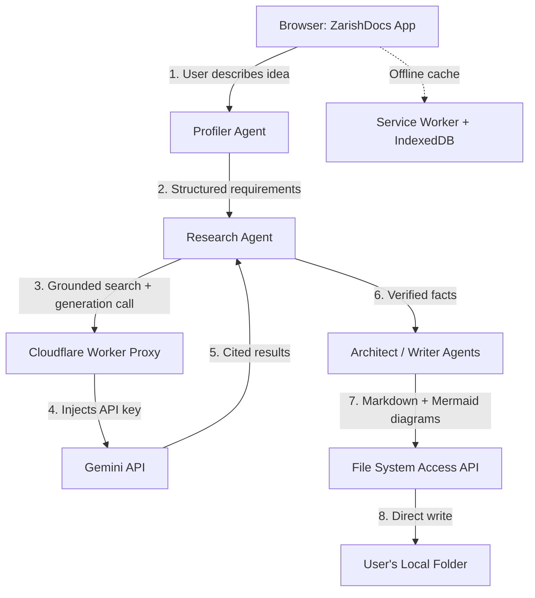

# 003-tech-design-zarishdocs.md
## Technical Design Document: ZarishDocs MVP
### Architecture, component design, and resolved build decisions

**Document type:** Specification
**Date:** August 11, 2026
**Author:** Mohammad Ariful Islam / ZarishSphere Foundation
**License:** Apache 2.0 (code) · CC BY 4.0 (documentation)
**Status:** V1 — Resolves the two open architecture questions carried from PRD-ZarishDocs-MVP.md

---

## 1. System Architecture Overview

ZarishDocs is a single-page, client-heavy web app with exactly one small piece of edge compute. Everything else — UI, agent orchestration, local file writes, semantic search — runs in the user's browser.



Only step 4 leaves a server-side footprint, and it is a stateless edge function, not a maintained backend.

## 2. ADR-001: LLM & Search Backend Architecture

### Decision
Ship a **hybrid, flexible architecture**: a free Cloudflare Worker proxy is the default path for every user, with an optional "bring your own key" mode for advanced users who want to bypass the shared proxy's rate ceiling or keep their calls fully isolated.

### Context
The research identified two viable options and asked for the "best, most flexible" resolution rather than a single rigid pick:
- **Proxy-only:** simplest for the user, but every user shares the proxy's underlying quota unless keyed separately
- **Own-key-only:** removes shared-quota risk, but pushes API key setup back onto a non-technical user — directly against the "no coding experience" target persona

### Decision detail
1. **Default path — Cloudflare Worker proxy.** A single stateless Worker function holds the `GEMINI_API_KEY` as an encrypted environment secret (`wrangler secret put GEMINI_API_KEY`), accepts a request from the browser, forwards it to the Gemini API, and returns the response with permissive CORS headers scoped to the ZarishDocs origin only. No user setup required — this is the zero-friction path the target persona (Maya) needs.
2. **Advanced path — user-supplied key.** A settings panel, clearly labeled "Advanced," lets a user paste their own free Gemini API key. When present, calls bypass the Worker and go straight from the browser to Gemini. The key is held only in browser `sessionStorage` (cleared on tab close, never written to disk, never sent anywhere but Google's endpoint) and the UI states plainly that the key is visible in that browser's network tab — an accepted, disclosed trade-off for a single-user local tool, consistent with the research's risk framing.
3. Both paths call the **same agent logic** — the app only swaps which endpoint it calls and whether it injects a stored key. This keeps the codebase single-path past the network layer.

### Search mechanism (resolves a gap the original research left open)
The Research Agent does not need a separate search API. **Gemini's built-in "Grounding with Google Search" tool** is free on the **Gemini 2.5 family** — up to **500 grounded requests/day shared across 2.5 Flash and Flash-Lite** on the free tier, tracked separately from plain generation quota. **Correction (verified 2026-08-11):** grounding on the **Gemini 3.x family is paid-only** (5,000 prompts/month free then billed, priced per search query executed rather than per prompt) — do not route grounded calls to 3.x. Enabling it is a single tool flag (`"tools": [{"google_search": {}}]`) on the same API call already being proxied — no second vendor, no second free-tier to track. The model returns inline citations and source URLs directly (`groundingMetadata`), which is exactly what the citation-first requirement needs.

**Caveat to build in, not just note:** grounding quota and plain generation quota are tracked separately by Google, but at least one third-party report found a client misconfiguration miscounting grounded calls against the wrong (much smaller) quota bucket. The Worker proxy should explicitly set the tool-use path correctly and log which quota a response consumed, so this failure mode is caught in testing rather than surfacing as a mysterious 429 for the user.

### Model routing (carried from research, reconfirmed)
| Task | Model | Why |
|---|---|---|
| Profiler Agent (casual text → structured requirements) | Gemini Flash-Lite | Highest daily ceiling, adequate for structured extraction |
| Research Agent (grounded search + fact verification) | Gemini 2.5 Flash | Free Google-Search grounding lives on the 2.5 family (500 RPD shared Flash + Flash-Lite); 3.x grounding is paid-only (corrected 2026-08-11) |
| Architect/Writer Agents (final document synthesis) | Gemini Flash | Best quality-to-quota ratio; Pro is no longer free-tier as of April 2026 |

### Consequences
- Zero cost preserved either way; zero ongoing server maintenance either way
- Shared-proxy users are subject to whatever aggregate rate limit the single Cloud project has — acceptable for personal/small-scale use, and the advanced path exists precisely for anyone who outgrows it
- The app must handle two auth code paths, adding minor complexity, in exchange for genuinely serving both the target persona and any power user

### Status
Accepted

---

## 3. ADR-002: Domain-Aware Research Sourcing

### Decision
Implement domain-aware sourcing as a **client-side routing config**, not as separate API integrations per domain. A lookup table maps topic keywords to a preferred-source domain list; that list is injected into the grounding prompt as an explicit instruction, and returned grounding citations are re-ranked (not filtered out) by whether they match the preferred domains for that topic.

### Context
The PRD requires that GitHub-related output research GitHub's own docs, Cloudflare-related output research Cloudflare's own docs, and so on, rather than generic aggregator sites. Google Search grounding does not expose a hard `site:` restriction parameter through the Gemini API — so this can't be enforced as a query filter. It has to be handled as prompt instruction plus post-response ranking.

### Decision detail

**Source-mapping config (`sources.config.json`, shipped with the app, user-editable later):**

```json
{
  "github": ["docs.github.com", "github.blog", "github.com"],
  "cloudflare": ["developers.cloudflare.com", "blog.cloudflare.com"],
  "google-cloud": ["cloud.google.com", "developers.google.com"],
  "google-workspace": ["developers.google.com", "workspace.google.com"],
  "fhir": ["hl7.org", "build.fhir.org"],
  "npm-package": ["npmjs.com", "github.com"],
  "browser-api": ["developer.mozilla.org", "developer.chrome.com", "caniuse.com"],
  "w3c-standard": ["w3.org", "webmachinelearning.github.io"],
  "default": []
}
```

**Pipeline:**
1. The Profiler Agent tags each structured requirement with a topic category from the config (falls back to `"default"` — general web grounding, no domain bias — if nothing matches).
2. The Research Agent's grounded prompt includes an explicit instruction: *"When researching \[topic\], prioritize official sources: \[preferred domain list\]. Only use other sources if the official docs don't cover this."*
3. When grounding results return, citations are re-ranked so preferred-domain sources appear first in the generated document's citation list; off-domain sources are kept, not discarded, since grounding can legitimately need third-party context — but they're visibly secondary.
4. The version-verification requirement ("check current stable version as of today, even for old resources") is handled by the same grounded call: the prompt template always asks for the specific version number and release date, not just "is this the right tool."

### Consequences
- No extra vendor integration, no extra free-tier to track — this rides entirely on the same grounded Gemini call from ADR-001
- Source-domain enforcement is a strong preference, not a hard guarantee, since the underlying Search grounding tool doesn't support hard filtering — this should be disclosed in the generated document's methodology note ("sources prioritized by domain, not exclusively restricted")
- The config is a plain JSON file, so extending it to new domains (e.g., adding FHIR R5-specific implementation guides, or a future ZARISH-INDEX-specific source set) is a one-line addition, not a code change

### Status
Accepted

---

## 4. ADR-003: Local File Access & Cross-Browser Fallback

### Decision
Use the `browser-fs-access` library rather than a hand-rolled feature check. It uses the native File System Access API where available (Chrome/Edge/Opera desktop) and transparently falls back to `<input type="file">` / `<a download>` elsewhere — one code path, not a maintained if/else fork.

### Context
This was carried forward from the research as an open UX question, not just a library choice: File System Access API support is Chromium-desktop-only. Safari, Firefox, and every mobile browser need a real fallback, not a dead end.

### Decision detail
- On supported browsers: one-time folder picker (`showDirectoryPicker`), all subsequent writes go straight to that folder with no repeated prompts.
- On unsupported browsers: the same "Choose your folder" button instead triggers a labeled "Your browser can't write directly to a folder — files will download instead" flow. Every generated file downloads individually with the same filenames it would have used on disk (`PRD-[AppName]-MVP.md`, etc.), so the user still ends up with an organized set they can drop into any folder manually.
- This distinction is surfaced **in the UI on first load**, not discovered mid-generation — consistent with the PRD's quality standard against silent failures.

### Consequences
- Full feature parity in outcome (user gets the same files either way); parity in convenience is not possible and shouldn't be promised
- No dependency on browser vendors changing course — Safari's non-support has been stable for years and shouldn't be treated as a near-term fix

### Status
Accepted

---

## 5. Component Breakdown

| Component | Responsibility | Runs where |
|---|---|---|
| Profiler Agent | Casual text → structured requirements + topic tags | Browser (calls proxy/direct API) |
| Research Agent | Grounded, domain-biased search and fact verification | Browser (calls proxy/direct API) |
| Architect Agent | Structures verified facts into document outlines | Browser (calls proxy/direct API) |
| Writer Agent | Renders outlines into final Markdown + Mermaid | Browser (calls proxy/direct API) |
| Cloudflare Worker Proxy | Injects API key, forwards request, returns response | Cloudflare edge (default path only) |
| File Writer | Local folder write via `browser-fs-access` | Browser |
| Offline Shell | Service Worker cache of app assets; IndexedDB for session/project state | Browser |

## 6. Tech Stack Summary

| Layer | Choice | Version (verified in research, August 2026) |
|---|---|---|
| LLM | Gemini 2.5 Flash-Lite (Profiler/Writer) / 2.5 Flash (Research grounding) | Free grounding is 2.5-family only — 3.x grounding is paid-only (verified 2026-08-11) |
| Local file access | `browser-fs-access` (npm) | Latest — ponyfill, no hard version pin needed |
| Diagram rendering | Mermaid.js | 11.16.1 |
| Semantic search (client-side, lazy-loaded) | transformers.js + `all-MiniLM-L6-v2` (ONNX) | ~23MB model, loaded on first use only |
| Offline shell | Service Worker + IndexedDB | Native browser APIs, no library pin |
| Hosting | Cloudflare Pages (static) + Cloudflare Workers (proxy) | Free tier, no card required |

## 7. Folder Structure (local output, ZUSS-aligned)

```
[user-chosen-folder]/
├── 001-research-[appname].md
├── 002-prd-[appname]-mvp.md
├── 003-tech-design-[appname].md
├── 004-adr-[appname]-[topic].md      (as generated, one per major decision)
└── diagrams/
    └── [nnn]-[diagram-name].mmd
```

## 8. Non-Functional Requirements Mapping

| PRD requirement | How this design satisfies it |
|---|---|
| Zero cost | Cloudflare Pages/Workers free tier + Gemini free tier + free grounding allowance — no paid dependency anywhere |
| Privacy-first, no telemetry | Only outbound call is the proxied/direct Gemini call; no analytics service integrated |
| Offline-capable | Service Worker serves the app shell offline; live research and new generations correctly require connectivity and fail with a clear message, not a silent hang |
| Zero lock-in | Output is plain Markdown + Mermaid text, portable by design; Worker proxy code is a single portable file, not a proprietary platform feature |
| Extensibility | `sources.config.json` and model-routing table are both plain config, not hardcoded — future domains or models are additive |

## 9. Open Questions Carried to Next Step

- Exact prompt template wording for the domain-bias instruction (ADR-002) — to be finalized during implementation, not architecture
- Whether the "advanced: own API key" panel ships in the 3-day MVP window or slips to the first post-MVP iteration — recommend treating it as a nice-to-have for MVP, since the proxy path alone satisfies the PRD's P0 features
- Confirming in practice (not just in documentation) that the Cloudflare Worker correctly separates grounding-quota calls from plain-generation-quota calls, per the miscounting risk noted in ADR-001

---

*ZarishSphere Foundation · V1 · August 2026*
*License: Apache 2.0 (code) · CC BY 4.0 (documentation)*
*GitHub: https://github.com/zarishsphere*

---
## Handoff Context
<!-- Machine-readable summary for the next workflow step. Do not delete; the next prompt in the workflow reads this block. -->
- Stage: tech-design
- App name: ZarishDocs
- User level: A (vibe coder)
- Target platform: web
- Budget: $0 (Cloudflare Worker proxy + Gemini free tier + free Google Search grounding, 5,000/month)
- Timeline: 3 days for MVP tier
- Source files: research-ZarishDocs.md → PRD-ZarishDocs-MVP.md → 003-tech-design-zarishdocs.md
- Resolved decisions: (1) Hybrid Cloudflare Worker proxy [default] + optional user-supplied key [advanced], (2) domain-aware sourcing via client-side config + prompt bias + citation re-ranking, (3) browser-fs-access library for local file writes with visible download fallback
- Carried forward: exact grounding prompt wording, whether "own key" panel ships in MVP or post-MVP, verifying grounding-vs-generation quota separation in practice
---
